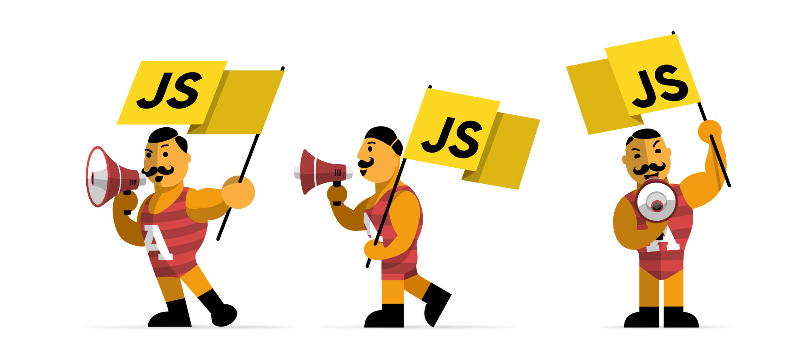

## JavaScript makes an appearance!

It's impossible to begin learning a new programming language and think it isn't exciting. It's like learning a new song to play on your instrument. The motivation to practice and master it are instantaneous, and discovering it's nuances and quirks are all part of the fun of learning. We began learning the basics of JavaScript in our software engineering class. For me, it's particularly interesting not just for the above reasons, but also because JavaScript is only the second programming language I have ever learned. I intrigues me to see where the differences in languages occur and to be able to compare what style I prefer. 

Having previously learned Java, I could definitely draw similarities between itself and JavaScript. But it was clear in just learning the basics that JavaScript has a lot more freedom than Java. In an obvious case, variables in Java are limited to a primitive type it was originally defined as, like int and float. However, in JavaScript, variables fall into two categories, let or const. Integers and floats alike can be stored within either a let or const, it does not have to be specifically specified what data type is being stored. Data can even be in an array with data of different types. This in itself seemed incredibly convenient to me, coming from the more restrictive background of Java. 

At this moment, I am still more comfortable with Java than JavaScript. But that is not to say that I believe Java would be a more suitable language for software engineering. I expect that JavaScript will be able to accomplish creative applications with the freedoms it has, which is necessary in such an open-ended endeavor like software engineering.

## Athletic Software Engineering joins in as well.

In a similar light, athletic software engineering is an experience just as exciting. Our class has begun to dabble in a daily Work Out of the Day (WOD), which is a coding assignment we must accurately complete in a certain amount of time. I am guilty of the age-old crime we call procrastination, meaning I have become an expert at cram coding the night before a deadline. The athletic schedule our class is based on focuses on the two areas I lack in, daily practice and time efficiency. Of course it is stressful to have a deadline basically every day, but it is not an impossible task. It is this chance for success that makes it all the more alluring, a challenge within reach. Attempting to complete tasks in a limited time isn't overwhelming, but it's no small deal either. When you actually put all your effort into and succeed in accomplishing them on time, the reward is greater for having done it in a faster time than you would have before. I believe this acclimation to complete effort, stress, and the success that comes with it will become a great tool for shaping my skills.
