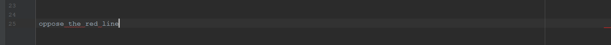

Many people think of “coding standards” in a trivial way—i.e. minutae such as how many spaces to indent, or whether you place the close-curly-brace on a new line by itself.

I, on the other hand, think that if you can only implement one software engineering technique to improve quality, it should be coding standards. Indeed, some coding standards can actually help you learn a programming language. How is that possible?

After your first week of using ESLint with IntelliJ, what are your impressions? Are you finding that getting the green checkmark is painful, or useful, or both, or something else entirely?

##  

 

