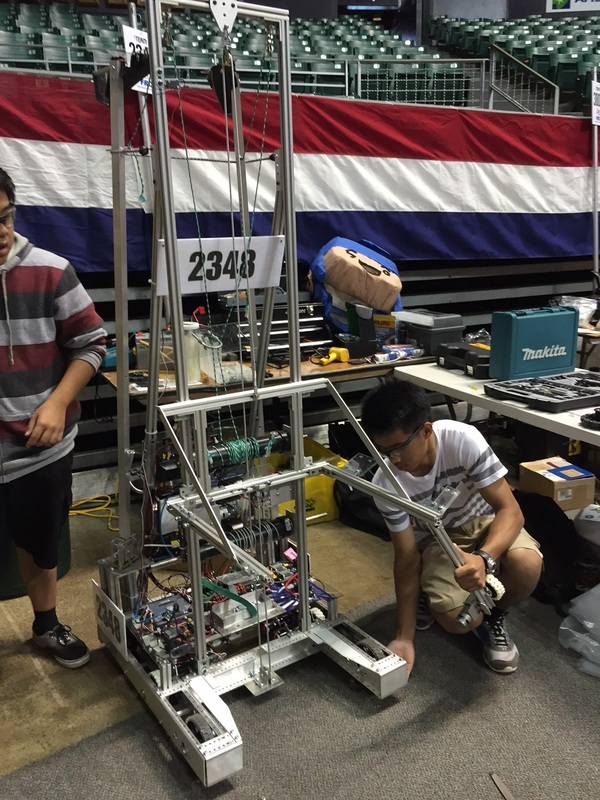
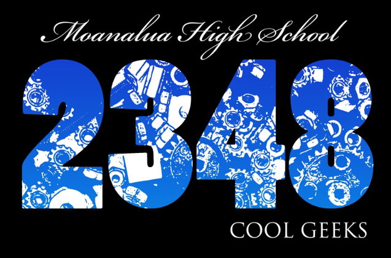

The FIRST Robotics Competition (FRC) is a 3-day international robotics competition held annually for middle and high schoolers. It consists of multiple matches played on an enclosed carpeted field, often around 27x54 ft in length. The matches are played between 6 robots, split between 2 alliances. Matches are usually 2 minutes 3o seconds in length, with a timed autonomous period before finishing with a driver controlled period. An alliance wins a match when they recieve more points than the other alliance before the match ends. Scores are earned based on the rules of that year's game. Scoring often consists of, but is not limited to, completing tasks such as: placing objects into certain areas, driving robots to a location, and moving objects into different positions. Teams are alloted a six-week 'build season', during which they design, build, program, and test a robot so it may be able to achieve scores.

I have participated in this competition for all four years of my high school career. In my final year of competition, I held the positions as lead programmer and driver on my robotics team. The 2015 game focused on lifting and stacking totes, cylindrical bins, and pool noodles. For the autonomous period, I programmed the robot to lift bins from a neutral territory mid-field, then drive towards our alliance zone so that other alliances may not access them. As for the driver controlled period, I programmed basic tank controls for driving, a camera for better view from afar, and sensors so that the robot will not extend it arm mechanism past its physical limits. Through this I came to familiarize myself with Java and Netbeans, along with the uses of motors and sensors. I also became accustomed to the trial and error process of programming. When driving the robot, I had to learn to recieve and process information in a high pressure situation, as I am not only reacting to what the robot is facing on the field, but also what the coaches and other alliance teammates are telling me. 

In addition to these positions, I also served as the team's President and Director of Interal Relations. I was in charge of mentoring and supporting the other teammates through advice, meetings, and socials. From planning meetings to facilitating socials, I have gained skill in organization, time-management, and leadership. In the end, my team made it to the semifinals of the competition. FRC had been an unforgettable experience and I am very proud of the team's efforts throughout the season. 

You can learn more about the competition at the [FRC Website](http://www.firstinspires.org/robotics/frc).

