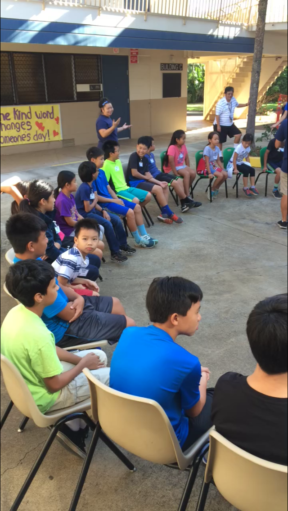
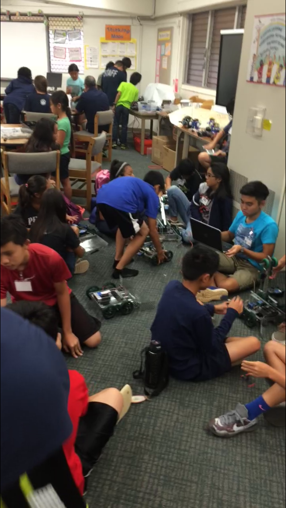
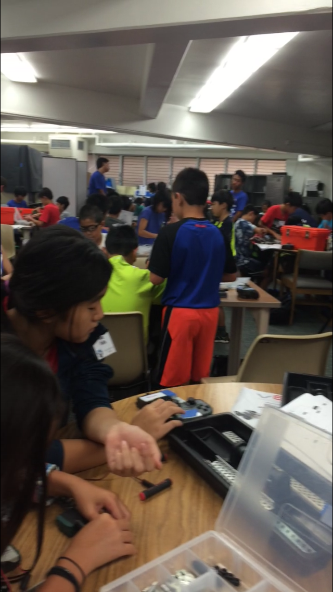
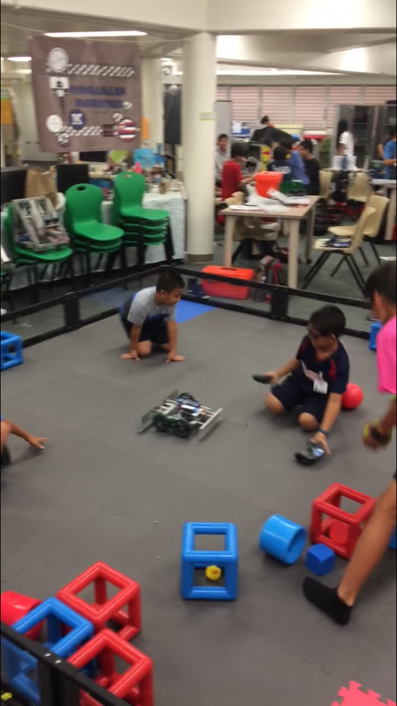

  
  
  
  

Camp Innovation is a week-long summer camp hosted by the Moanalua Middle School (MMS) robotics team. The mentors of this camp are the faculty advisers and alumni of the MMS robotics team, of which I fall into the second category. Students that participate in this camp are from grades K-8 and not necessarily students of Moanalua Middle. They are taught through hands-on experiences with two different robots, a VEX robot and another that varies by the year. In 2016, the second robot was an Artec Push Button Programmable Robot. Mentors help students build and program their robots, teach them about the benefits of STEM (Science, Technology, Engineering, Math) and aim to increase their interest in it through.

As a mentor, I assisted students in building both robots not only through manuals, but also using their own ideas to modify the existing robots. I also programmed their VEX robots for user control along with teaching them to program with the Artec robots. Other duties I performed during the week were: set up and clean up for the camp's location, creating props for the activities, leading energizers and exercises, supervising other mentors, and acting as a Master of Ceremonies for the robotics tournament held at the end of camp. 

After participating as a mentor in the camp for four years, I have learned how to interact with kids. Finding the right way to motivate them, encouraging them to build friendships and teamwork, and answering their questions with explanations they'll understand are all just parts of the mentoring experience. It is somewhat pressuring to have to constantly act as a role model, but the pressure has served well to push me into the shape of one. I have also learned how to collaborate with other mentors in a busy environment. Working in one as large and chaotic as a camp of 40 children, cooperation amongst leaders is key. Overall, my social skills have improved, as I had to work with people of all ages and positions, from teachers to young students, to high school mentors to parents.

More information about the 2016 camp can be found [here](http://www.moanaluamiddle.org/apps/news/article/561447).
