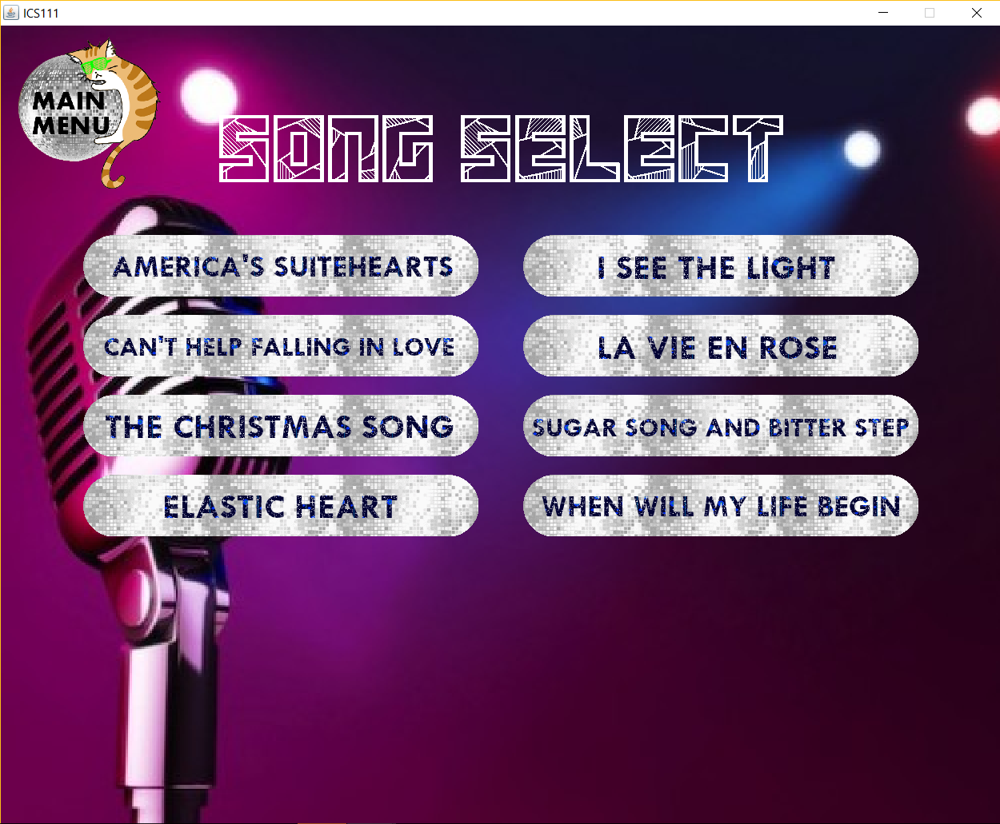
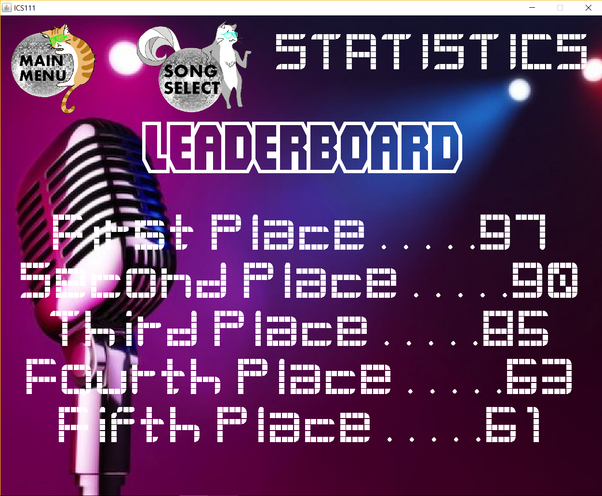
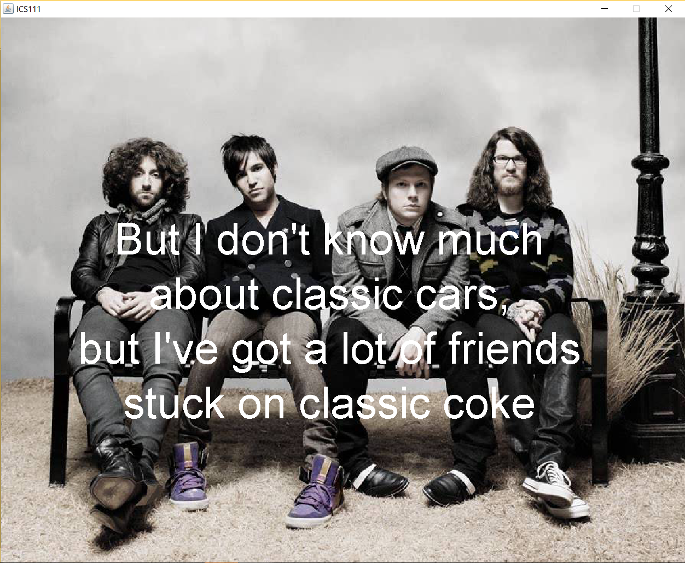

As a conclusion to ICS 111, Introduction to Computer Science I, our class was required to create an open ended project in groups of 4. The projects had to include the object-oriented programming and Java skills we collected over the semester, including basics like separate classes, implementing an array (or ArrayList), and reading/writing a file. My team's final product was a karaoke machine, which main ability presented lyrics in time to a song so that a user may sing along using the displayed words. After the song was completed, a randomized score was displayed and written to a file as statistics. The machine consisted of a home screen, from which the user could access a statistics screen, song selection screen, and a random song. From the song selection screen, the user could choose 1 of 8 songs to sing along to.

  
  

In this project, I was in charge of storing and displaying the statistics in a leaderboard, timing lyrics to 2 songs, and routing the screens to one another through buttons. For the statistics, I had a random integer generated at the end of a song and written to a file. When the statistics page was accessed, this file was read, placing the integers it contained within an ArrayList. After the integers were sorted using [bubble sort](https://en.wikipedia.org/wiki/Bubble_sort), the top 10 scores were displayed on the screen. For the lyrics, the strings were text elements translated and hidden using [EZ Graphics](http://www2.hawaii.edu/~dylank/ics111/), with wait functions to accommodate for timing.

Being the first programming assignment I've worked on in a group, I have gained experience in cooperative code writing. It was complicated to divide roles equally. But even more difficult was controlling versions without a source control software or website, which in retrospect, would have been an optimal choice. Nevertheless, we found ways to work around this, mainly emailing one person all versions of the code for them to piece together. As I became this person at the end of the project, it helped me practice parsing code along with finding ways to combine them fluidly. For my own code writing, I secured more practice with Java, specifically using FileWriter and Scanner for reading/writing a file.
