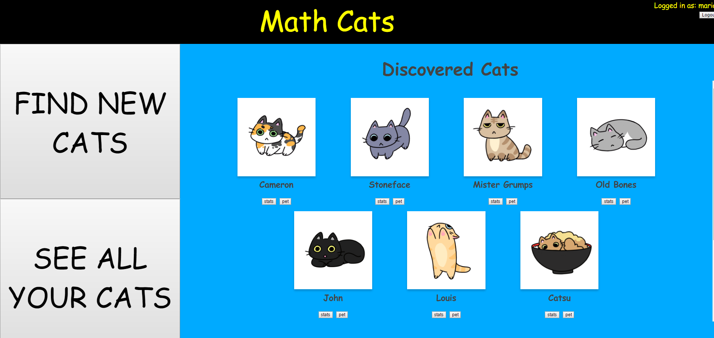
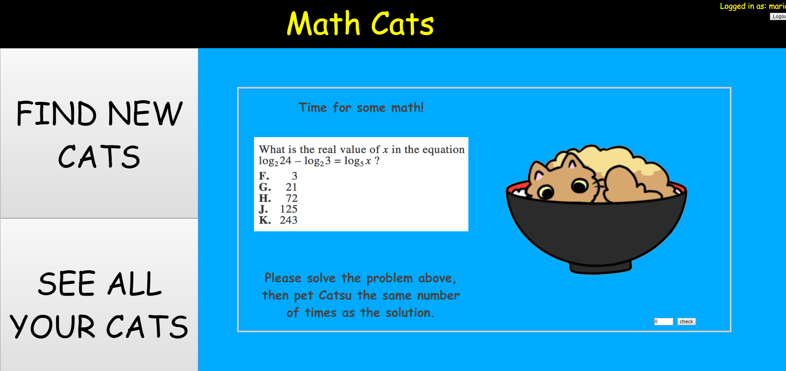
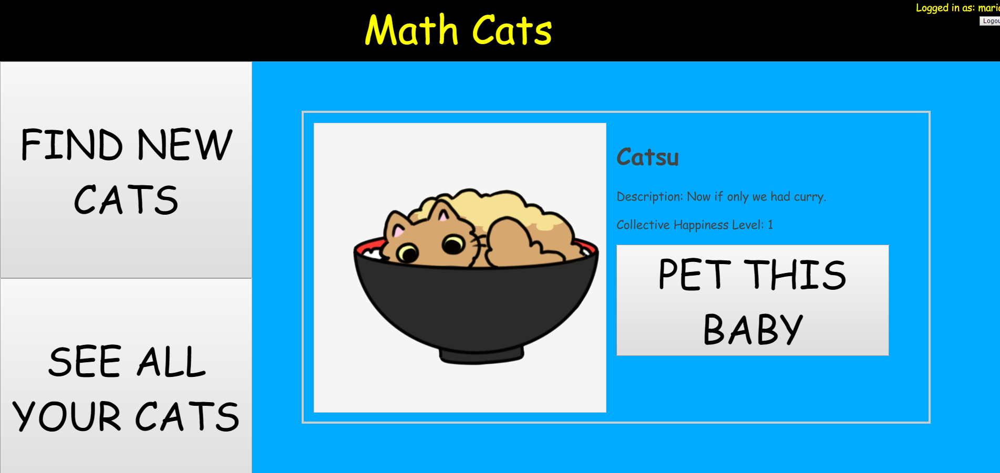
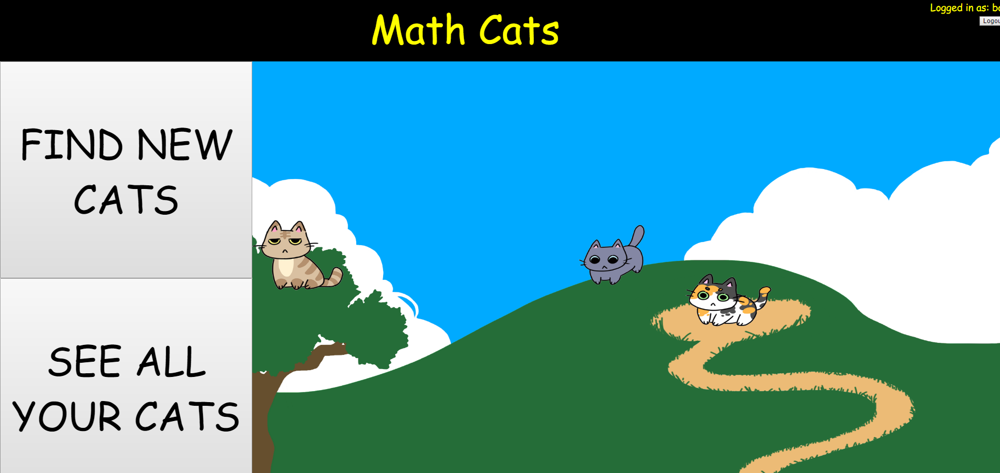

As a final project for ICS 321, a databases course, I developed a web app game called Math Cats. The inspiration for Math Cats was the popular mobile game [Neko Atsume](https://en.wikipedia.org/wiki/Neko_Atsume), in which you store data on cats you observe in a virtual garden. Similarly, the objective of Math Cats was to meet and collect data on cats that appeared in a virtual garden.

Cats appear in the garden based on a number randomly generated per login. Players can then click on a cat's image to view its data and add them to the collection of cats they've already met. Another part of gameplay was petting a cat. By selecting "pet" for a previously met cat, users are shown a math problem equal to the number of times they must pet a cat to make it happy. Users would then submit an answer - submitting a correct answer would result in one point being added to the cat's collective happiness level, incorrect answers would result in no change. The collective happiness level is not individual per user, it is a sum of all points gained by every user.

  
  
  

Using Java Server Faces (JSF) as a framework and Oracle as the backend database, I created the web pages and designed a database to store user and cat data. New to the app making scene, it was difficult at first to wrap the idea around integrating different programming languages for full functionality. However, a [separate project in software engineering](https://mariahgaoiran.github.io/projects/CS) gave me practice to make such an idea easier to comprehend. In addition, I had never created a web page that effectively communicated with a database to store data based on actions in the browser. I was forced to learn not only how to create, connect, and transfer data between the Oracle database, but also the uses of JSF.

Though this was a databases project, I also spent a substantial amount of time working on the app's design using HTML and CSS. In particular, it was incredibly difficult solving the issues for the garden page.

The garden was a series of partially transparent images, layered to create the illusion of being a cohesive image. This was done for consistency of image placement, which may have been altered depending on browser and window size, had the images not been of the same size. The transparency and sizing was created through use of Autodesk SketchBook Express 6.2 and Adobe Photoshop Elements 10.  However, due to this method, I was having difficulty getting the event listeners recognize clicks on the separate layers. In the end, I used an image map to recognize clicks only in specific areas in the garden based on the specific locations cats would appear. Though they were clickable even when the cat was not visible, they were programmed to show data for an "unknown" cat if clicked at this time.
Majority of the cats were drawn by my friend Erin Wong, while the background and remaining cat were drawn by myself.

